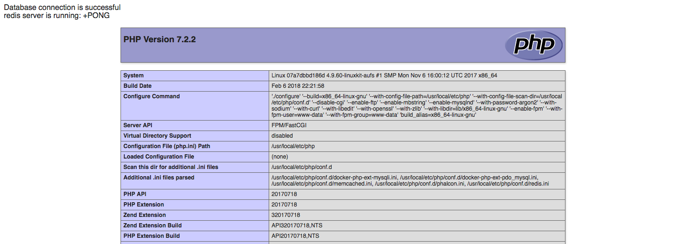

# multi-container-interconnection

## 该项目为docker多容器互联方案最后方案
> --lsky

    1. git clone git@github.com:Lsky1026/multi-container-interconnection.git

    2. docker network create range-net

    3.docker-compose up -d

    4.所有依赖全部安装完成 打开浏览器 输入localhost:8001及看到phpinfo、mysql和redis连接信息
    